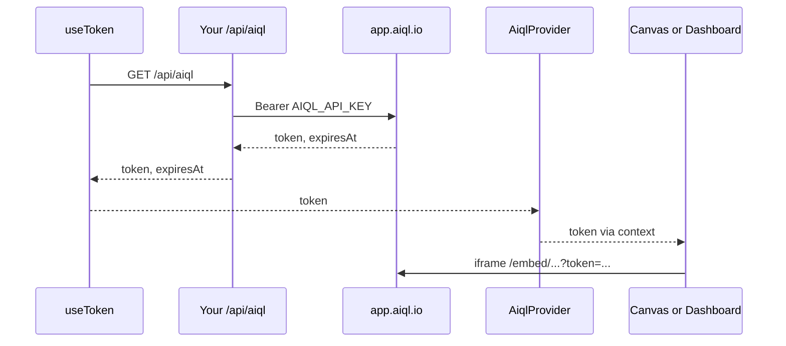

<p align="center">
  <picture>
    <source media="(prefers-color-scheme: dark)" srcset="./assets/logo-dark.svg" />
    
  </picture>
</p>

<p align="center">
  <a href="https://github.com/AiQL-io/aiql-python">Python</a>
  &nbsp;·&nbsp;
  <a href="https://github.com/AiQL-io/aiql-typescript">TypeScript</a>
  &nbsp;·&nbsp;
  <b>React</b>
</p>

# AiQL React SDK

The [AiQL React SDK](https://docs.aiql.io/sdks/react/overview) (`@aiql.io/react`) embeds AiQL Observatory tools — **Canvas** (Brainstorm) and **Dashboard** (Analyze) — in your React app via iframe. Your API key stays on the server. The browser only receives a short-lived workspace-scoped embed token.

To learn more, check out the [Documentation](https://docs.aiql.io/sdks/react/overview) and [API reference for components](https://docs.aiql.io/sdks/react/components/provider).

## Installation

You will need Node.js 18+ and React 18+ (or React 19), plus npm (or another package manager) installed on your local development machine.

```shell
npm install @aiql.io/react
```

## Secure token architecture

The SDK never sends your AiQL API key to the browser. Your backend mints an embed token; the client fetches it and passes it into a provider that all embed components share.



1. Your server calls `app.aiql.io/api/embed/tokens` with `Authorization: Bearer <AIQL_API_KEY>`.
2. `useToken()` `GET`s `/api/aiql` and auto-refreshes before expiry.
3. `AiqlProvider` holds the token (and theme) for the subtree.
4. `Canvas` / `Dashboard` build the embed URL and render the iframe.

Set these env vars on your server:

```bash
AIQL_API_KEY=...
AIQL_WORKSPACE_ID=...
```

## Usage

### Create the token endpoint

#### Next.js App Router — `app/api/aiql/route.ts`

```ts
import { createNextHandler } from "@aiql.io/react/server";

export const GET = createNextHandler();
```

#### Express

```ts
import { createExpressHandler } from "@aiql.io/react/server";

app.get("/api/aiql", createExpressHandler());
```

#### Any framework

```ts
import { mintWorkspaceToken, handleTokenRequest } from "@aiql.io/react/server";

const { token, expiresAt } = await mintWorkspaceToken();
// or
const { status, body } = await handleTokenRequest();
```

Optional overrides:

```ts
createNextHandler({
  apiKey: "...",
  workspaceId: "...",
  ttlSeconds: 1800,
});
```

### Embed Canvas and Dashboard

```tsx
import { AiqlProvider, Canvas, Dashboard, useToken } from "@aiql.io/react";

function App() {
  const { token, status, error, reload } = useToken(); // GET /api/aiql

  if (status === "loading" || status === "idle") return <p>Loading…</p>;
  if (status === "error" || !token) {
    return (
      <div>
        <p>{error ?? "Failed to load token"}</p>
        <button type="button" onClick={reload}>
          Retry
        </button>
      </div>
    );
  }

  return (
    <AiqlProvider token={token} theme="auto">
      <Canvas canvasId="your-canvas-id" title="My canvas" />
      <Dashboard dashboardId="your-dashboard-id" title="My dashboard" />
    </AiqlProvider>
  );
}
```

You can also mint the token some other way and pass it straight into `AiqlProvider` without using `useToken`.

### Provider

```tsx
<AiqlProvider token={token} theme="auto">
  {children}
</AiqlProvider>
```

- `token` (required) — embed JWT (or a full embed URL)
- `theme` (optional) — `"light"` | `"dark"` | `"auto"` (default `"auto"`)

### Components

| Component | Props |
|-----------|--------|
| `Canvas` | `canvasId`, `title?`, `className?`, `style?`, `onLoad?`, `onError?`, `renderLoading?`, `renderError?` |
| `Dashboard` | `dashboardId`, `title?`, `className?`, `style?`, `onLoad?`, `onError?`, `renderLoading?`, `renderError?` |
| `Frame` | `tool`, `resourceId`, plus the same presentation props as above |

`token` and `theme` always come from `AiqlProvider` context.

## Package exports

| Import | Contents |
|--------|----------|
| `@aiql.io/react` | `AiqlProvider`, `useToken`, `useAiql`, `Canvas`, `Dashboard`, `Frame`, types |
| `@aiql.io/react/server` | `createNextHandler`, `createExpressHandler`, `handleTokenRequest`, `mintWorkspaceToken` |

The `./server` entry is React-free and safe to use in Node/Next route handlers.

## Documentation

- [React SDK overview](https://docs.aiql.io/sdks/react/overview)
- [Components](https://docs.aiql.io/sdks/react/components/provider)
- [Hooks](https://docs.aiql.io/sdks/react/hooks/use-token)
- [Server handlers](https://docs.aiql.io/sdks/react/server/handlers)

## Notes

`/embed/*` routes allow framing from any origin. Access is still gated by the embed JWT.

## Authors

This library is created by [AiQL](https://aiql.io), with contributions from the [open source community](https://github.com/AiQL-io/aiql-react/graphs/contributors).
